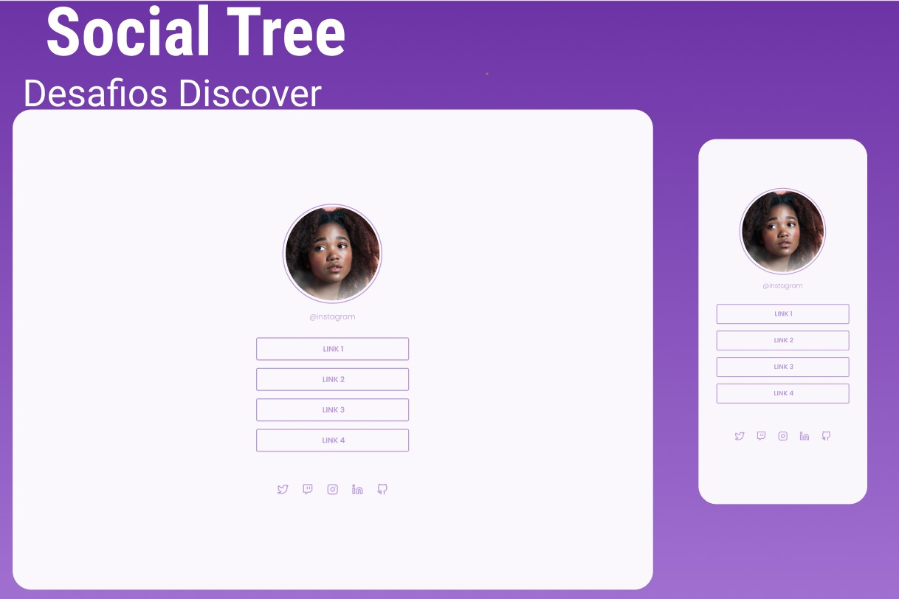

<h1 align="center"> Social Tree </h1>

 Desafio do discover, promovido pela Rocketseat para ensino de tecnologias WEB. 

  <a href="#-tecnologias">Tecnologias</a>&nbsp;&nbsp;&nbsp;|&nbsp;&nbsp;&nbsp;
  <a href="#-projeto">Projeto</a>&nbsp;&nbsp;&nbsp;|&nbsp;&nbsp;&nbsp;
  <a href="#-layout">Layout</a>

 

  

## 🚀 Tecnologias

Esse projeto foi desenvolvido com as seguintes tecnologias:

- HTML e CSS
- Git e Github

## 💻 Projeto

O Social Tree é um projeto de redes sociais.

## 🔖 Layout

Você pode visualizar o layout do projeto através [DESSE LINK](<https://www.figma.com/file/Nnm7O8OcTySd8AZIRpwUY3/DD-%2F-Social-links-(Copy)?node-id=1102%3A2>). É necessário ter conta no [Figma](https://figma.com) para acessá-lo.
